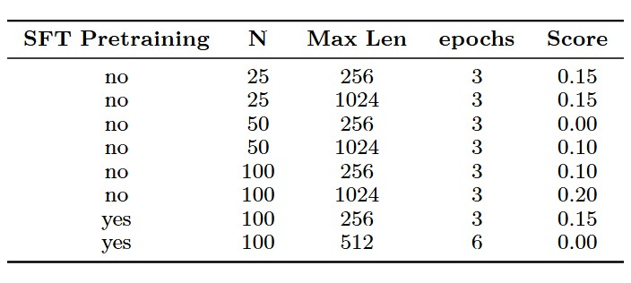

# HPML Project: GRPO Fine-Tuning under Hardware Constraints

## Team Information
- **Team Name**: GRPO
- **Members**:
  - Timothy Wang (tjw2145)
  - Manush Kalwari (mmk2266)
  - Troy Daniels (td2847)

---

## 1. Problem Statement

We fine-tune and run inference on two instruction-tuned LLMs **DeepSeek-Coder-7B-Instruct-v1.5** (6.91B parameters) and **Phi-3.5-Mini-Instruct** (3.82B parameters) for math reasoning under hardware constraints using a single NVIDIA T4 GPU. The task involves solving two math benchmarks: 
- **Countdown**: easier, requires generating equations under constraints.
- **AIME 2024**: harder, advanced competition-style math problems.

We apply **Group Relative Policy Optimization (GRPO)**, **Supervised Fine-Tuning (SFT)**, and **quantization** to ensure feasibility and performance.

---

## 2. Model Description

- **Models Used**: DeepSeek-Coder-7B-Instruct-v1.5, Phi-3.5-Mini-Instruct
- **Framework**: PyTorch
- **Custom Methods**:
  - Applied GRPO for fine-tuning on task-specific JSONL datasets.
  - Used SFT prior to GRPO for improved reward shaping.
  - Employed 4-bit and 8-bit quantization via bitsandbytes.
  - Integrated LoRA adapters uploaded to HuggingFace for modular fine-tuning.

---

## 3. Final Results Summary

The following results are from the **Countdown** dataset. The highest score of 20% was obtained by non-quantized Phi model, trained on 100 samples with max-token length of 1024 trained for 3 epochs.

On the **AIME 2024** dataset, which is significantly more challenging, our lightweight models—Phi-3.5 Mini and quantized DeepSeek-R1—could not keep up, achieving near-zero scores (e.g., ~0.05 accuracy). highlighting the challenge of solving advanced competition problems even with fine-tuning. However, the outputs produced by our adapters did reflect the models’ capacities to learn reasoning, despite their poor performance.

| Metric               | Value                                |
|----------------------|--------------------------------------|
| Final Score          | 20 %                                 |
| Inference Latency    | ? ms                                 |
| Model Size           | Phi- 3.82B (non-quantized)           |
| Peak Memory Use      | Fits within 16 GB T4 VRAM            |
| Training Time/Epoch  | 3 epochs                             |
| Device               | NVIDIA T4 GPU                        |

*Table: Experiments with Phi-3.5 Mini model on Countdown task*



---

## 4. Reproducibility Instructions

### A. Requirements

```bash
pip install -r requirements.txt
```

### B. Wandb Dashboard
View training and evaluation metrics here:
```bash
https://wandb.ai/mtt-hpml/projects
```
### C. Training 
GRPO only (baseline):
```bash
python3 grpo_training.py --model phi --quantize --task aime \
--train_dataset_path ../tasks/aime/aime_train_dataset.jsonl \
--eval_dataset_path ../tasks/aime/aime_eval_dataset.jsonl
```

#### SFT Training:
```bash
python3 sft_training.py --model deepseek --task countdown
```
#### GRPO after SFT:
```bash
python3 upload_adapter.py --adapter_path ./outputs/... \
--repo_id YOUR_HF_REPO_ID
python3 grpo_training.py --model deepseek --adapter YOUR_HF_REPO_ID ...
```
### D. Evaluation
```bash
python eval.py --weights checkpoints/best_model.pth
```
for inference:
```bash
python3 query_model.py \
--model deepseek-ai/deepseek-coder-7b-instruct-v1.5 \
--adapter_repo TDani/deepseek_aime_n100_mcl_256_quantized \
--prompt_file ../tasks/aime/aime_eval_dataset.jsonl \
--output_file deepseek_outputs/output.jsonl
```

### E. Profiling

1. There are two ways to enable profiling
    - In the main branch, uncomment to line of code. Specifically
        - Switch to TroysBranch, and run from there, this is where profiling mostly happended to avoid overhead
        - on_trace_ready found on line 203 and callbacks=[ProfilerCallback(profiler)] on line 213 (not recommeded)
2. Profiling is currently only capturing one step because of the large memory pressure to profile (writes 2-3 GB per step)
    - This can be changed by updating the schedule
3. Run the GRPO script normally and profiling traces will be saved to ./logs/profiler directory
3. All profiles can be found on a running VMs until May 16th (after that will be taken down) at URLs:
    - http://34.42.25.189:6006/#pytorch_profiler (Compares running GRPO against T4 and L4 with and without quantization)
    - http://34.170.77.214:6006/#pytorch_profiler (Compares running GRPO with deepseek and Phi with and without quantization)


5. Notes
- All GRPO datasets are in tasks/, preprocessed via get_aime_dataset.py or get_countdown_dataset.py.
- Fine-tuned adapters are uploaded via upload_adapter.py.
- Final scores are located in inference/scores/.
- Profiling logs are saved in ./logs/profiler.

